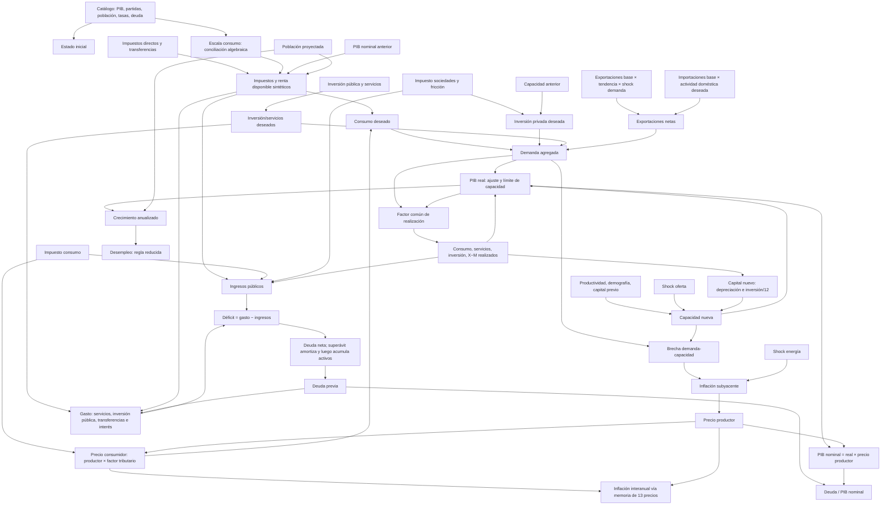

# Inventario económico verificable — modelo 0.1.0

## Alcance

Este documento describe el comportamiento ejecutado por `src/core/engine.ts`, con constantes de `src/core/model.ts`, políticas de `src/core/policy.ts` y selección de datos de `src/core/data.ts`. Ante discrepancias entre documentación y programa, se describe el código. La presencia de una ecuación o una regresión no constituye justificación ni validación económica.

Referencia: catálogo local `es-reviewed-2026-09-30.1`, año base derivado 2025 y semilla habitual 1847. No se ejecutaron ni editaron pruebas, datos, snapshots, resultados o motor.

Clasificación: **dato de catálogo** = registro y tipo indicados en JSON; **derivado/calibrado algebraicamente** = cálculo sobre esos registros; **supuesto** = constante/regla hipotética sin estimación empírica documentada; **regla de implementación** = operación programada, sin inferir su justificación.

## Datos seleccionados

`selectBase` prueba años en orden descendente. Por ID, toma la observación no proyectada, finita, con fuente, periodo y fecha de publicación, con publicación más reciente. Exige 14 IDs, concilia `PIB = consumo + servicios + inversión + exportaciones − importaciones` dentro de `max(0,01; PIB × 0,00001)`, y valida el dominio de tasas. 2025 no está fijado por código: se deriva de esta versión del catálogo.

| ID | Valor | Unidad/periodo | Tipo; fuente indicada; publicación |
|---|---:|---|---|
| PIB | 1.690,012 | mil millones EUR; 2025 | source-estimate; INE, Contabilidad Nacional Anual, serie 2023–2025; 2026-09-18 |
| Consumo | 932,945 | mil millones EUR; 2025 | source-estimate; misma fuente; 2026-09-18 |
| Servicios | 324,514 | mil millones EUR; 2025 | source-estimate; misma fuente; 2026-09-18 |
| Inversión | 367,451 | mil millones EUR; 2025 | source-estimate; misma fuente; 2026-09-18 |
| Exportaciones | 616,488 | mil millones EUR; 2025 | source-estimate; misma fuente; 2026-09-18 |
| Importaciones | 551,386 | mil millones EUR; 2025 | source-estimate; misma fuente; 2026-09-18 |
| Población | 49.570.725 | personas; 2026-01-01 | source-estimate; INE, Estadística Continua de Población; 2026-02-12 |
| Población anterior | 49.128.297 | personas; 2025-01-01 | source-estimate; misma fuente; 2026-02-12 |
| Desempleo | 0,105 | fracción; 2025 | source-estimate; INE, EPA, submuestra; 2026-03-25 |
| Inflación | 0,029 | fracción; 2025-12 | observed; INE, IPC diciembre 2025; 2026-01-15 |
| Deuda | 1.698 | mil millones EUR; 2025 | source-estimate; Banco de España, deuda AAPP T4; 2026-03-31 |
| Nacimientos | 321.164 | personas; 2025 | source-estimate; INE, estimaciones de nacimientos y defunciones; 2026-02-18 |
| Defunciones | 446.982 | personas; 2025 | source-estimate; misma fuente; 2026-02-18 |
| Ocupados | 22.221.100 | personas; 2025 | source-estimate; INE, EPA, submuestra; 2026-03-25 |

La identidad concilia: 932,945 + 324,514 + 367,451 + 616,488 − 551,386 = 1.690,012. Las poblaciones refieren a enero y las cuentas nacionales a 2025; el motor las toma tal cual sin armonización adicional. `employed` es obligatorio para seleccionar la base, pero no entra en `stepState`; la interfaz lo usa para derivar ocupación con una participación inicial implícita.

## Inicialización

Mes 0 fija PIB real y nominal al PIB de catálogo; precios productor/consumidor son 1; inflación inicial y subyacente son la observación de inflación. El historial de 13 precios se genera como `(1 + inflación)^((i−12)/12)`, no son observaciones históricas mensuales. Capacidad inicial = PIB; capital = PIB × 3,2; paro y deuda = catálogo; activos públicos = 0. Consumo, servicios, inversión y X−M iniciales toman el catálogo. Inversión pública inicial = PIB × 3 %, una división sintética de inversión total.

Los tres hogares iniciales se calculan con la política predeterminada. `consumptionScale` se resuelve para que su consumo agregado coincida con el consumo de catálogo. Ingresos, impuestos, transferencias, gasto y saldo fiscal iniciales se reconstruyen con fórmulas; no son cuentas públicas observadas.

## Reglas económicas ejecutadas

Los flujos macroeconómicos son tasas anualizadas; el cambio mensual de stocks divide flujos por 12. Magnitudes reales: miles de millones de euros constantes del año base. Nominales/fiscales: miles de millones de euros. Las tasas se guardan como fracciones y `Point` las expone como porcentaje.

### Hogares, renta, impuestos y consumo

Grupos sintéticos: cuotas de población `[0,4; 0,4; 0,2]`, ingresos `[0,18; 0,40; 0,42]`, transferencias `[0,55; 0,35; 0,10]`.

```text
renta bruta_i = PIB nominal anterior × 0,66 × cuota renta_i
variación tipo_i = taxShift/100 + multiplicador_i × progressivity/100
  multiplicador: grupo inferior −0,5; intermedio 0; superior +1
tipo_i = clamp(tipo base_i + variación tipo_i, 0, 0,65)
impuesto_i = renta bruta_i × tipo_i
transferencia_i = PIB nominal anterior × 0,17 × (1 + transfers/100) × cuota transferencias_i
renta disponible_i = renta bruta_i − impuesto_i + transferencia_i
consumo deseado_i = renta disponible_i × clamp(propensión_i × consumptionScale, 0, 1)
renta real/persona_i = renta disponible_i × 10^9 /
  (población nueva × cuota población_i × precio consumidor provisional)
```

Tipos base `[8 %, 18 %, 28 %]` y propensiones `[0,94; 0,83; 0,62]` son supuestos. `consumptionScale` es una calibración algebraica al consumo agregado inicial, no una estimación estructural. `taxShift` desplaza tipos; progresividad afecta especialmente a grupos extremos con multiplicadores asimétricos y cada tasa se recorta a 0–65 %. Transferencias varían un total sintético inicialmente igual a 17 % del PIB y se reparten con cuotas fijas. No son microdatos, deciles ni prestaciones individuales.

El consumo deseado agregado se divide por el precio consumidor para formar demanda; después se multiplica por el factor común de realización. Los presupuestos de hogar usan PIB nominal rezagado para evitar un lazo algebraico, no producción del mismo paso.

### Impuesto al consumo, inversión y servicios

```text
factor_consumo = (1 + consumptionTax/100) / (1 + 0,11)
precio consumidor provisional = precio productor anterior × factor_consumo
inversión privada deseada = (inversión base − PIB base × 0,03)
  × (capacidad anterior / PIB base)
  × [((1 − corporateTax/100)/(1 − 0,20)) ^ 1,25]
  × exp(−3 × investmentFriction/100)
inversión pública deseada = PIB real anterior × publicInvestment/100
servicios deseados = PIB real anterior × services/100
```

11 % y 20 % son referencias de política del código. Elasticidad 1,25, fricción exponencial 3, base sintética de inversión privada y las proporciones de política son supuestos de diseño, no calibraciones a datos españoles. El factor de impuesto al consumo es un cambio de nivel frente a 11 %, no se compone cada mes. Servicios e inversión pública usan PIB rezagado en los pasos.

### Comercio, demanda, producto y capacidad

```text
base doméstica = C catálogo + servicios catálogo + inversión catálogo
exportaciones = exportaciones base × (1 + 0,02)^(mes/12) × (1 + shock demanda)
importaciones = importaciones base × demanda doméstica deseada / base doméstica
NX deseadas = exportaciones − importaciones
demanda = consumo + servicios + inversión deseados + NX deseadas
crecimiento potencial = 0,009/12 + 0,35 × crecimiento población/12
efecto capital = 0,27 × (inversión anterior/12/capital anterior − 0,04/12)
capacidad nueva = capacidad anterior × exp(crecimiento potencial + efecto capital + shock oferta)
objetivo = min(demanda, capacidad nueva × 1,05)
PIB real nuevo = PIB real anterior + 0,32 × (objetivo − PIB real anterior)
realización = PIB real nuevo / demanda
```

Cada componente deseado (C, servicios, inversión, inversión pública y NX) se multiplica por realización. Así el código impone `PIB = C + servicios + inversión + X − M`. Si la demanda excede 105 % de capacidad, registra aviso de racionamiento proporcional. Es un cierre agregado; no es equilibrio general ni una contabilidad completa de sectores.

El crecimiento exportador anual 2 % es supuesto; importaciones son proporcionales a actividad doméstica deseada con factor base implícito 1. No hay tipo de cambio o precios relativos. `externalDemandExposure=0,35` aparece en `M` pero no se consulta en el motor localizado: el shock entra directamente multiplicando exportaciones por `1 + external.demand`. No es una elasticidad operativa.

### Capital, precios e inflación

```text
capital nuevo = capital anterior × (1 − 0,04/12) + inversión realizada/12
brecha = (demanda − capacidad)/capacidad
objetivo inflación = 0,02 + brecha × 0,20 + shock energía × 0,16
inflación subyacente = clamp(0,85 × subyacente anterior + 0,15 × objetivo, −0,04, 0,30)
precio productor nuevo = precio productor anterior × exp(subyacente/12)
precio consumidor nuevo = precio productor nuevo × factor_consumo
inflación interanual = precio consumidor nuevo / precio consumidor de 12 pasos antes − 1
```

Todo el flujo de inversión realizado se añade al capital. La capacidad del paso utiliza inversión y capital del estado anterior; el capital actualizado afecta periodos siguientes. Productividad 0,9 %, depreciación 4 %, elasticidad capital 0,27, ancla 2 %, persistencia 0,85, respuesta de brecha 0,20 y exposición energética 0,16 son hipótesis. La inflación reportada contiene cambio de nivel tributario, además del precio productor. La memoria inicial es interpolada.

### Empleo y desempleo

```text
crecimiento = ln(PIB real nuevo / PIB real anterior) × 12
paro nuevo = clamp(paro anterior − 0,22 ×
  (crecimiento − 0,009 − crecimiento población)/12, 0,015, 0,45)
```

El coeficiente 0,22 es regla reducida hipotética sin ajuste empírico documentado; límites 1,5–45 % son límites de dominio, no intervalos de incertidumbre. No hay salarios, negociación, participación laboral cambiante, horas o empleo sectorial. El ID de ocupados no entra al motor; la interfaz deriva una cifra suponiendo fija la participación inicial.

### Fiscalidad y deuda

```text
recaudación directa = suma de impuestos de hogares
impuesto consumo = consumo realizado × precio consumidor × tasa/(1+tasa)
impuesto corporativo = PIB nominal × 0,25 × tasa corporativa
otros ingresos = PIB nominal × (0,10 + 0,045)
ingresos = directa + consumo + corporativo + otros
intereses = deuda bruta anterior × 0,025
gasto = (servicios + inversión pública) × precio productor
        + transferencias hogar + intereses
déficit = gasto − ingresos
deuda neta nueva = deuda bruta anterior − activos públicos anteriores + déficit/12
deuda nueva = max(0, deuda neta nueva); activos públicos nuevos = max(0, −deuda neta nueva)
```

Participación de beneficios 0,25, cotizaciones 0,10, otros ingresos 0,045 y tipo de deuda 2,5 % son supuestos. El impuesto al consumo se extrae de base antes de impuestos. Un superávit reduce deuda y luego crea activos públicos sintéticos. No hay vencimientos, prima soberana, tenedores, financiación monetaria o reacción fiscal. Deuda/PIB = stock de deuda al cierre / PIB nominal anualizado.

### Demografía

```text
nacimientos/mes = población anterior × (nacimientos base/población base)/12
defunciones/mes = población anterior × (defunciones base/población base)/12
residuo/mes = población anterior ×
  (población base − población anterior base − nacimientos base + defunciones base)
  / población base / 12
población nueva = población anterior + nacimientos − defunciones + residuo
```

La suma reproduce la variación relativa entre ambas poblaciones seleccionadas, descompuesta en tasas constantes. Residuo se describe como movilidad y ajustes, no como migración observada. No se proyectan edades, fecundidad, mortalidad o migración endógenas.

## Parámetros y procedencia epistemológica

El comentario en `model.ts` declara los coeficientes de comportamiento como hipótesis explícitas, no estimaciones empíricas. **Supuesto** no significa validado.

| Parámetro | Valor | Uso y clasificación |
|---|---:|---|
| Fracción ingreso bruto / PIB; transferencias / PIB | 0,66; 0,17 | escala sintética de hogares; supuestos |
| Cuotas población / renta / transferencias | 40/40/20; 18/40/42; 55/35/10 % | reparto fijo; supuestos |
| Tipos efectivos base; propensiones | 8/18/28 %; 0,94/0,83/0,62 | hogares; supuestos, no tipos legales; propensiones escaladas algebraicamente al consumo del catálogo |
| Impuestos referencia consumo/sociedades; inversión pública | 11 %; 20 %; 3 % | referencias de política supuestas |
| Beneficios / cotizaciones / otros ingresos | 0,25 / 0,10 / 0,045 | cuotas fiscales supuestas |
| Productividad / capital-producto / depreciación | 0,9 % anual / 3,2 / 4 % anual | hipótesis; stock inicial derivado mediante 3,2 |
| Elasticidades capital / retorno / fricción | 0,27 / 1,25 / 3 | supuestos |
| Ajuste producto / holgura capacidad | 0,32 / 5 % | supuestos |
| Ancla / persistencia / respuesta de precios / exposición energía | 2 % / 0,85 / 0,20 / 0,16 | supuestos |
| Respuesta desempleo / coste deuda | 0,22 / 2,5 % anual | supuestos |
| Tendencia exportación / probabilidad de shock | 2 % anual / 10 % mensual | supuestos |
| Exposición demanda externa | 0,35 | definida pero inerte, no usada en ecuaciones actuales |
| Límites inflación / desempleo | −4 a 30 % / 1,5 a 45 % | recortes de dominio, no intervalos estadísticos |
| `consumptionScale` | depende de base | derivado por conciliación con consumo seleccionado |

Los dominios/pasos de `policy.ts` (p. ej. impuesto consumo 5–18 %, fricción 0–8) son límites de entrada de interfaz/validación, no fuente de elasticidades o evidencia económica.

## Shocks y reproducibilidad

`draw(seed, month, channel)` mezcla determinísticamente semilla, mes y canal. Una probabilidad 0,10 decide shock; otros canales fijan tipo, signo y magnitud. Para uniforme `U∈[0,1)`: energía `(0,5+U) × signo × 0,12`; demanda `(0,5+U) × signo × 0,04`; oferta `(0,5+U) × signo × 0,004`. Energía entra al objetivo de inflación; demanda a exportaciones; oferta al crecimiento logarítmico de capacidad. Ambas ramas reciben el mismo shock mensual. Son sucesos ficticios, no observaciones.

## Instituciones y variables no modeladas

Los ocho controles económicos que entran en reglas son `taxShift`, `progressivity`, `consumptionTax`, `corporateTax`, `transfers`, `publicInvestment`, `services`, `investmentFriction`. `elections` y `termMonths` generan eventos de calendario/texto, sin cambiar el estado económico. `expression` y `judicialReview` se validan y almacenan, pero no se leen en reglas económicas o eventos localizados. No hay ganador, partido, probabilidad electoral o coeficiente institucional económico.

No hay salarios/rentas laborales, negociación, empleo sectorial, crédito, tipo de cambio, política monetaria, balances sectoriales completos, ahorro financiero, tipos de deuda endógenos o inversión privada financiada por ahorro. Las cuotas sintéticas de grupos permanecen fijas. El catálogo no aporta ingresos/gastos fiscales requeridos; son reconstruidos sintéticamente. Exportaciones no reaccionan a precios o tipo de cambio, importaciones solo escalan con actividad deseada. Población no reacciona a decisiones económicas.

## Mapa causal del código

Las flechas representan dependencias implementadas, no validez teórica.



Variables auxiliares omitidas por legibilidad: cuotas/tipos de hogares, multiplicadores, memoria de precios, límites `clamp`, factor de realización y saldo neto deuda-activos. `employed` no es causa del estado simulado. No hay flecha desde controles institucionales al estado económico.

## Diferencias documentales encontradas

1. `externalDemandExposure=0,35` está declarado, pero no se usa; el shock multiplica directamente exportaciones por `1 + external.demand`.
2. `employed` se requiere para seleccionar la base pero no evoluciona en el motor; UI deriva ocupación manteniendo implícita la participación inicial.
3. `docs/MODELO.md` coincide con el código sobre precios iniciales interpolados, cierre agregado, retardo del capital y ausencia de efecto institucional cuantificado.
4. La progresividad es una transformación algebraica sobre tres tipos artificiales, con multiplicadores −0,5/0/+1 y límites 0–65 %; no una curva fiscal observada.
5. El presupuesto/ingresos son sintéticos y no se seleccionan series de cuentas públicas entre los IDs requeridos.

## Validación pendiente

El proyecto no documenta derivación teórica o estimación empírica de las elasticidades de consumo, inversión, capacidad, precios, desempleo, demografía o fiscalidad aquí enumeradas. Tampoco aporta validación fuera de muestra, intervalos de incertidumbre estructural o identificación causal. Los golden/regresiones prueban estabilidad de implementación e identidades, no plausibilidad económica. La fase posterior deberá evaluar relaciones con fuentes, frecuencia, metodología y unidades apropiadas; este inventario no altera ni recalibra el modelo.

## Referencias inspeccionadas

`src/core/engine.ts`, `src/core/model.ts`, `src/core/policy.ts`, `src/core/data.ts`, `src/core/random.ts`, `src/core/types.ts`, `public/data/spain.json`, `docs/MODELO.md`, `docs/playbook/PLAYBOOK.md`, `docs/playbook/INFORME-EJECUCION.md`.
